# Kafka

Cái này để học về Kafka và cách xây dựng cụm kafka

---
## 1. Kafka là gì:

>Kafka là một nền tảng xử lý dữ liệu theo luồng (streaming platform) mã nguồn mở được dùng để truyền tải dữ liệu theo thời gian thực giữa các hệ thống, ứng dụng hoặc dịch vụ.

Ví dụ:  
Tưởng tượng ta đang xây dựng một ứng dụng thương mại điện tử gồm: Hệ thống đặt hàng, hệ thống thanh toán, tồn kho.

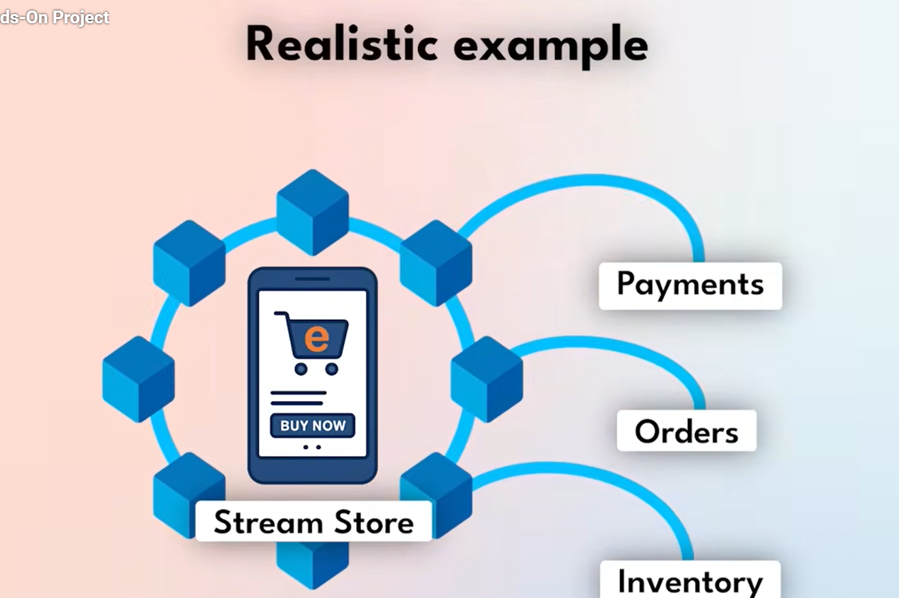

>Khi ta đặt hàng thì một chuỗi sự kiện sẽ xảy ra như:  
:arrow_right: Người dùng đặt hàng :arrow_right: Kho hàng được update :arrow_right: email xác nhận được gửi tới khách hàng...

Với một web nhỏ, kiến trúc đơn giản thì các dịch vụ này có thể trực tiếp gọi tới nhau.

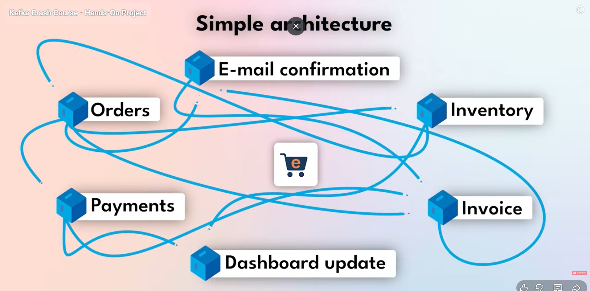

Điều này sẽ hoàn toàn ổn cho tới khi có một lượng lớn khách hàng truy cập vào hệ thống đó. Giả sử có một dịch vụ gặp trục trặc thì toàn bộ hệ thống đó sẽ gặp trục trặc theo vì các dịch vụ của chúng đều phụ thuộc lẫn nhau.

Để giải quyết vấn đề đó thì ta sẽ dùng Kafka.

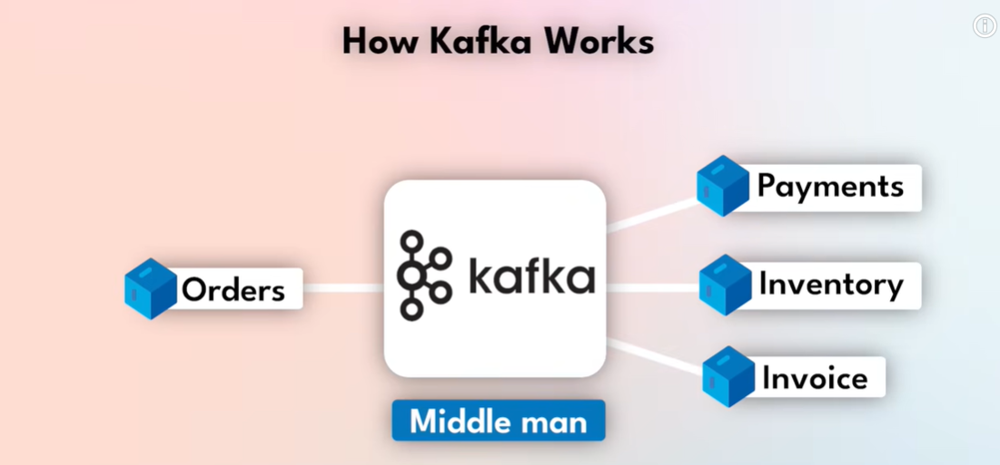

>Kafka như một người trung gian làm nhiệm vụ phân phối thông tin cho các dịch vụ khác.

Kafka lưu trữ dữ liệu trong topic logs, và đảm bảo việc truyền tin có thứ tự trong mỗi partition.

Như vậy "Orders" sẽ không còn cần phải đợi Payments, Inventory,... hoàn thành xong công việc của nó rồi mới gửi lên, mà nó tin rằng Kafka sẽ phân phối hết các orders cho 3 thằng kia.  
:arrow_right: như vậy Orders có thể liên tục nhận order ***(events)*** và gửi cho Kafka.

"Orders" sẽ được gọi là ***Producer***, còn "Payments", "Inventory",... sẽ được gọi là ***Consumer***

---

### Events

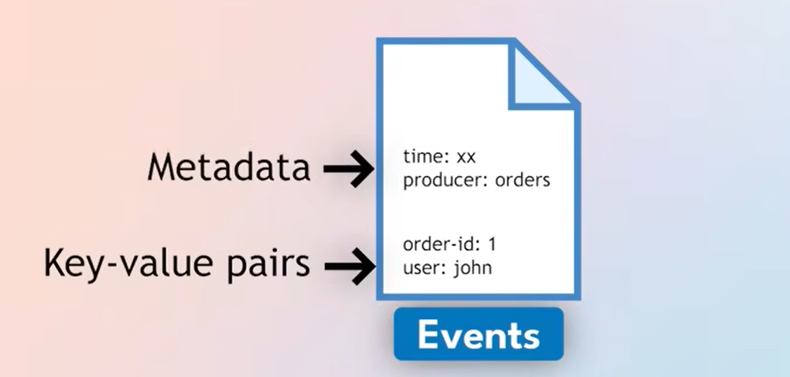

>Events sẽ có giá trị là cặp Key-Value, đồng thời có cả Metadata, trong đó có thời gian được gửi đến, producer là ai...

---

### Topic

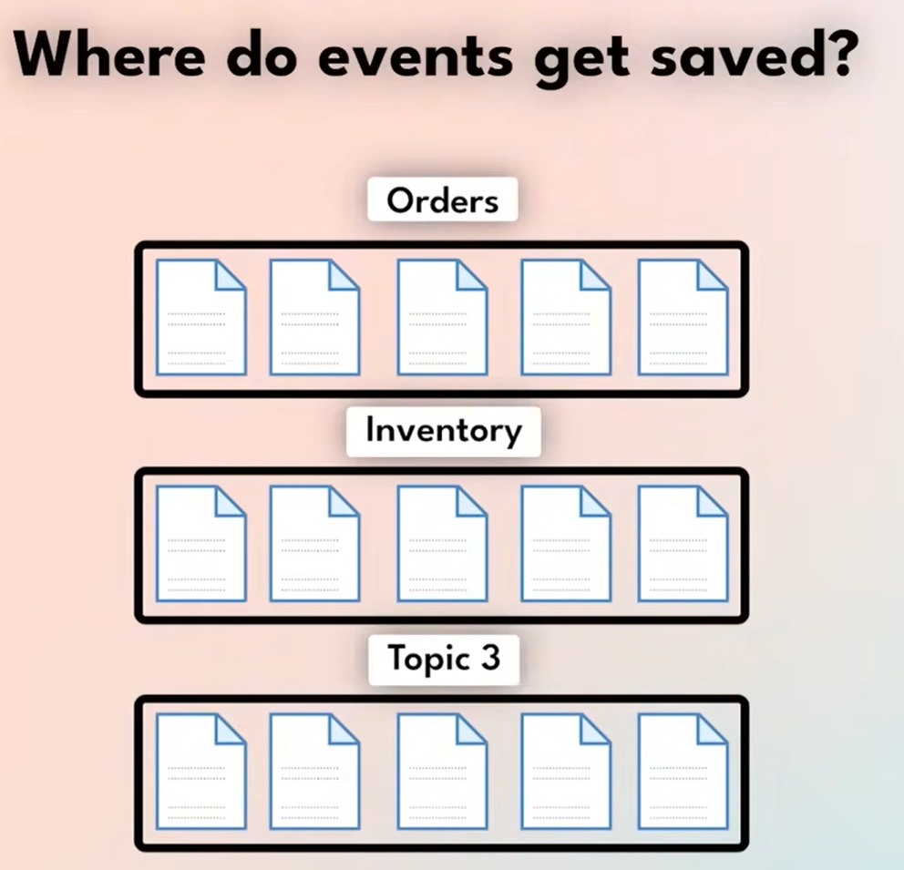

Các events sẽ được sắp xếp theo các ***Topic***. Mỗi ***Topic*** là một luồng dữ liệu độc lập và có thể được coi là một danh sách các tin nhắn liên quan.

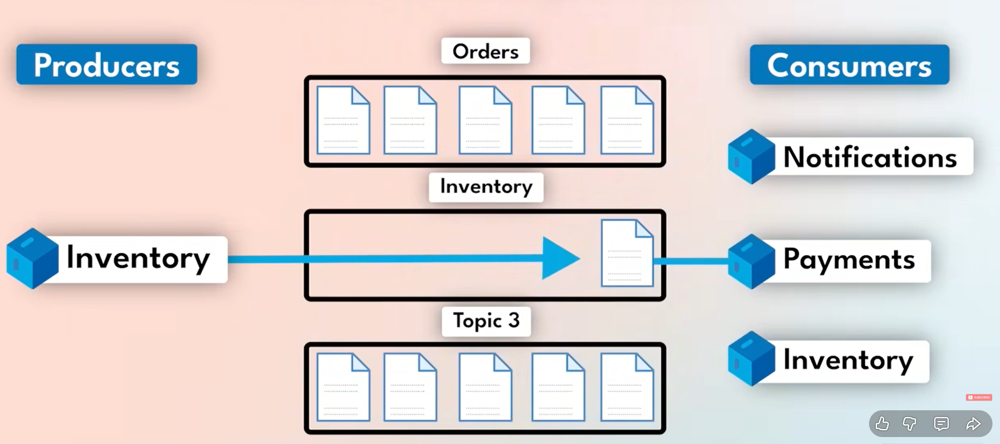

***Consumer*** sẽ ***Subscribe*** tới ***Topic*** cụ thể và mỗi khi ***Producer*** gửi ***Events*** tới ***Topic*** thì các ***Consumer*** đã ***Subscribe*** với ***Topic*** tương ứng sẽ nhận được thông tin từ Kafka.

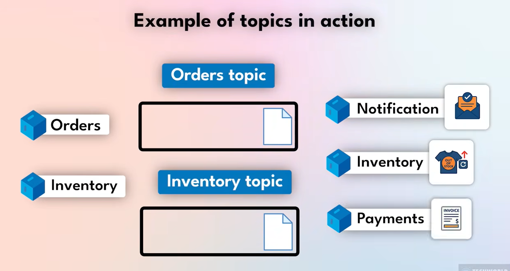

Ví dụ:
> Khi có đơn hàng mới, hệ thống “Orders” gửi sự kiện vào Orders topic. Các hệ thống khác đăng ký (subscribe) vào topic này để nhận thông tin.  
>1. Notification: gửi thông báo.  
>2. Inventory: cập nhật kho.  
>
>Khi kho thay đổi, Inventory service gửi thông tin sang Inventory topic.  
Payments service đọc từ Inventory topic để thực hiện thanh toán.

:bulb: Ý nghĩa thực tế: Mỗi hệ thống chỉ cần biết topic, không cần biết cụ thể ai gửi hay nhận dữ liệu.  
Giúp hệ thống độc lập, mở rộng dễ dàng và không phụ thuộc lẫn nhau.

>:arrow_right: Kafka ở đây đóng vai trò như trung tâm liên lạc, đảm bảo mọi dịch vụ đều nhận được dữ liệu mới nhất một cách đáng tin cậy và theo thời gian thực.

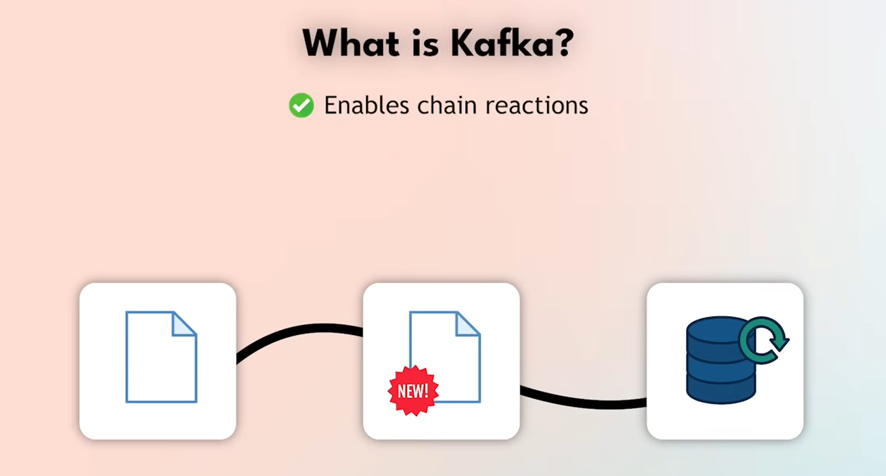

>Như vậy ta có thể coi Kafka là một công cụ cho phép thực hiện các phản ứng dây chuyền trong đó một sự kiện kích hoạt nhiều hành động, bao gồm tạo các sự kiện khác hoặc là update cơ sở dữ liệu.

Kafka được ứng dụng trong lĩnh vực y tế, logistic, marketing,...

---

### Partition

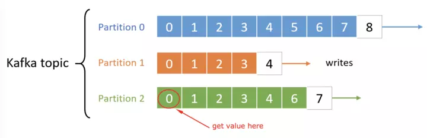

>Mỗi ***Topic*** có thể được chia thành nhiều phân vùng. ***Partition*** là một phần nhỏ của chủ đề và đóng vai trò quan trọng trong việc phân tán dữ liệu và tăng hiệu suất. Mỗi ***Partition*** được lưu trữ trên một ***Broker*** và dữ liệu được đọc và ghi vào từng ***Partition*** một. ***Consumer*** sử dụng ***offset*** để theo dõi dữ liệu đã đọc.

---

### Cluster, Broker

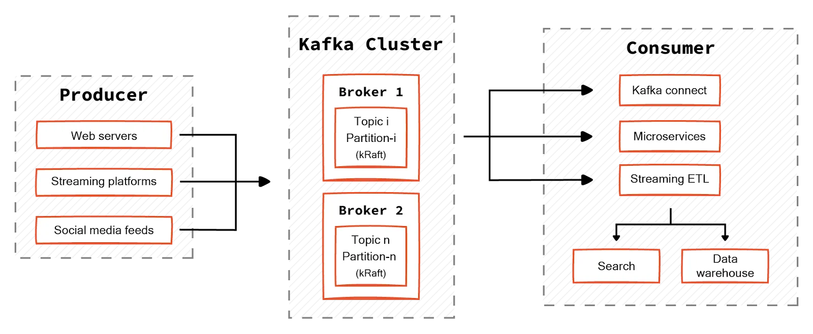

>***Cluster***: Một tập hợp các máy chủ ***Brokers*** bao gồm ít nhất 1 ***Broker*** nhưng thường là nhiều ***Broker*** hoạt động cùng nhau. ***Cluster*** có vai trò quan trọng trong việc cung cấp tính mở rộng, tính nhất quán và độ tin cậy cho việc xử lý dữ liệu thời gian thực.  

>***Broker***: Là thành phần cốt lõi của ***Kafka***, đại diện cho máy chủ xử lý và lưu trữ dữ liệu ***Kafka***. Một cụm ***Kafka*** thường bao gồm nhiều ***Broker*** và mỗi ***Broker*** có thể xử lý sản xuất ***Producer*** và tiêu thụ ***Consumer*** dữ liệu. ***Broker*** chịu trách nhiệm quản lý và lưu trữ các ***Partition*** của các chủ đề ***Topics***. Thời hạn lưu trữ tùy thuộc vào cài đặt.

Mỗi Broker có ID riêng (ví dụ: broker-1, broker-2, …)

Mỗi topic partition sẽ có leader và replica để đảm bảo fault-tolerance.

---

### ZooKeeper (đã không còn xuất hiện ở các bản mới)

>***ZooKeeper***: Là một hệ thống quản lý tập trung được sử dụng để quản lý và duy trì trạng thái của các ***Broker*** trong một cụm ***Kafka***. Nó chịu trách nhiệm trong việc ***theo dõi*** và ***quản lý*** các ***Broker*** giúp ***Kafka*** hoạt động ổn định và đảm bảo tính nhất quán.

---

### Consumer Groups

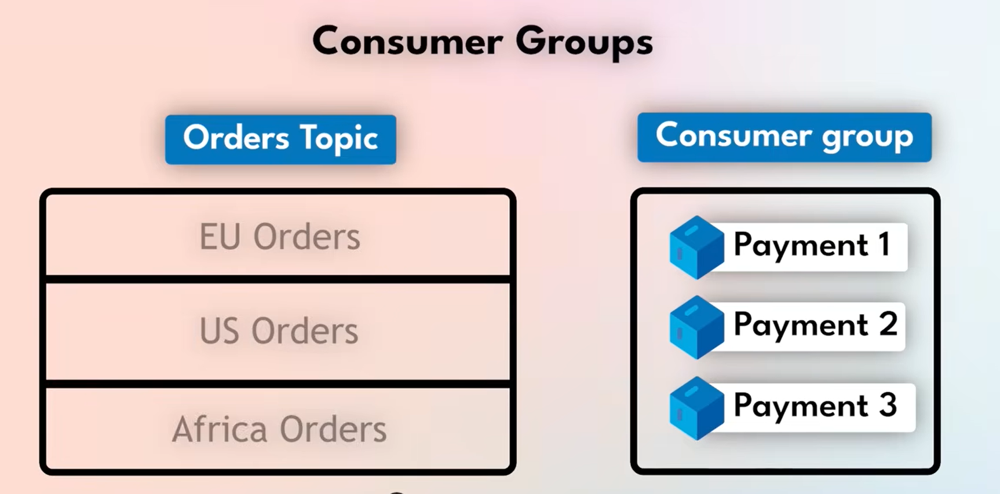

>Bằng việc tạo ra một ***consumer group*** giúp chia đều khối lượng công việc của một chức năng dịch vụ cho các dịch vụ khác. Như các 10 đơn của US Orders có thể chia đều cho Payment 1, Payment 2,...
